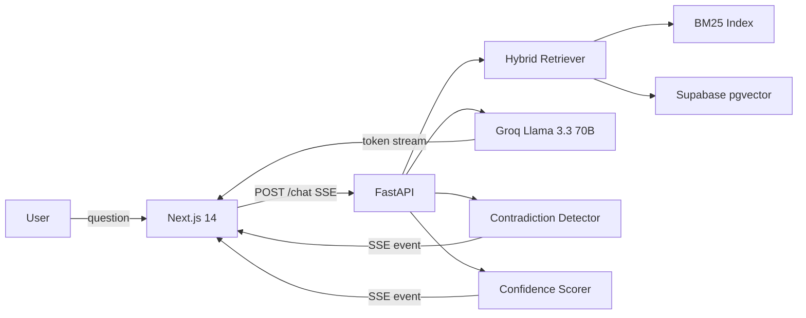

# NEXUS — The Institutional Memory Engine

> Companies lose **42% of their knowledge** when senior employees leave.
> NEXUS doesn't let that happen.

[](https://github.com/SKAY/nexus/actions/workflows/ci.yml)
[](https://python.org)
[](LICENSE)

**[Live Demo → nexus.skay.dev](https://nexus.skay.dev)**

---

## What makes NEXUS different

Most RAG systems just answer questions. NEXUS goes further — it detects when two documents in your knowledge base **contradict each other**, shows both conflicting statements side by side with sources, and gives you a **confidence score** on every answer so you always know how much to trust it.

Built with production architecture: hybrid BM25 + semantic retrieval, token-streaming responses, and quantified evaluation via RAGAS.

---

## Features

| Feature | Description | Status |
|---------|-------------|--------|
| 🔴 **Contradiction Radar** | Detects conflicting statements across documents, surfaces both sides with sources | ✅ Done |
| ✅ **Radical Transparency** | Confidence score (0–100%) + plain-English reasoning on every answer | ✅ Done |
| 📄 **Source Attribution** | Every answer linked to the exact document and page it came from | ✅ Done |
| 📁 **Demo Mode** | Pre-loaded corpus with designed contradictions — zero friction for visitors | ✅ Done |
| 📤 **Multi-file Upload** | Drag-and-drop PDF/DOCX/TXT upload with per-file progress | ✅ Done |
| ⚡ **Token Streaming** | Word-by-word streaming via SSE — responses feel instant | ✅ Done |

---

## Evaluation Results (RAGAS)

Evaluated on 20 QA pairs derived from the demo corpus using [RAGAS](https://github.com/explodinggradients/ragas).

| Metric | Target | Score |
|--------|--------|-------|
| Faithfulness | > 0.85 | **TBD** |
| Answer Relevancy | > 0.80 | **TBD** |
| Context Recall | > 0.75 | **TBD** |

*Run `python tests/eval/ragas_eval.py` (requires live backend + demo loaded) to reproduce.*

---

## Architecture



### How it works

1. **Ask a question** — NEXUS searches your documents using hybrid keyword + semantic retrieval, fusing results with Reciprocal Rank Fusion.
2. **Get a transparent answer** — Every response includes source cards (document + page + excerpt), a confidence score, and plain-English reasoning.
3. **Contradictions surface automatically** — A second LLM call compares retrieved chunks. When two documents disagree, NEXUS flags the conflict in real time with both statements side by side.

---

## Tech Stack

| Layer | Technology | Notes |
|-------|-----------|-------|
| Frontend | Next.js 14 + TypeScript | App Router, SSE streaming |
| Styling | TailwindCSS + Framer Motion | Dark mode, animated cards |
| Backend | FastAPI (Python 3.11) | Async, LCEL pipeline |
| LLM | Groq → Llama 3.3 70B | Free tier, ~200 tok/s |
| Embeddings | all-MiniLM-L6-v2 | 384-dim, runs on CPU |
| Vector DB | Supabase pgvector | Free, production-grade |
| Keyword Search | BM25 (rank_bm25) | Hybrid retrieval |
| Document Parsing | Unstructured | PDF, DOCX, TXT, MD |
| Evaluation | RAGAS | Faithfulness, relevancy, recall |
| Backend Deploy | Railway | Always-on, Dockerfile |
| Frontend Deploy | Vercel | CDN, custom domain |
| **Cost** | **$0** | All free tiers |

---

## Quick Start

### Try the demo (no setup)
Visit **[nexus.skay.dev](https://nexus.skay.dev)** and click **Try Demo**.

### Run locally

Requirements: Python 3.11, a [Supabase](https://supabase.com) project (free), a [Groq](https://console.groq.com) API key (free).

```bash
git clone https://github.com/SKAY/nexus.git
cd nexus

# Backend
pip install -e ".[dev]"
cp .env.example .env
# Fill in: GROQ_API_KEY, SUPABASE_URL, SUPABASE_KEY

# Run the Supabase migration (once)
# Copy src/nexus/index/migrations/001_create_chunks.sql into Supabase Studio → SQL Editor → Run

PYTHONPATH=src uvicorn nexus.api.main:app --reload --port 8000

# Frontend (new terminal)
cd nexus-frontend
npm install
npm run dev
```

Open [http://localhost:3000](http://localhost:3000).

### Windows shortcut

Double-click `start.bat` to start the backend.

---

## Deployment

### Backend → Railway

1. Push repo to GitHub
2. Go to [railway.app](https://railway.app) → **New Project** → **Deploy from GitHub**
3. Railway auto-detects `railway.json` and `Dockerfile`
4. Add environment variables in the Railway dashboard (copy keys from `.env.example`)
5. Note your Railway URL: `https://your-app.railway.app`

### Frontend → Vercel

1. Go to [vercel.com](https://vercel.com) → **Add New Project** → import your GitHub repo
2. Vercel auto-detects `vercel.json` and sets the root to `nexus-frontend/`
3. Add environment variable: `NEXT_PUBLIC_API_URL = https://your-app.railway.app`
4. Deploy

### Custom domain (optional)

Point `nexus.skay.dev` CNAME to `cname.vercel-dns.com` in your DNS provider.

---

## Running Tests

```bash
# Unit tests (no backend required)
PYTHONPATH=src pytest tests/unit/ -v

# Integration tests (requires running backend + demo loaded)
PYTHONPATH=src pytest tests/integration/test_e2e.py -v -m integration

# RAGAS evaluation (requires running backend + demo loaded)
PYTHONPATH=src python tests/eval/ragas_eval.py
```

---

## Project Structure

```
nexus/
├── src/nexus/
│   ├── api/            # FastAPI routes (chat, upload, demo, documents, insights)
│   ├── ingest/         # PDF/DOCX/TXT parsing and chunking
│   ├── index/          # Supabase pgvector + BM25 + hybrid retriever
│   ├── rag/            # LCEL chain, Groq client, versioned prompts
│   ├── features/       # Contradiction detection, confidence scoring
│   └── config.py       # Pydantic settings
├── nexus-frontend/     # Next.js 14 App Router
│   ├── app/            # Landing page + chat interface
│   └── components/     # ChatWindow, ConfidenceBar, ContradictionBadge, SourceCard, …
├── demo_corpus/        # 5 curated documents with designed contradictions
├── tests/
│   ├── unit/           # pytest unit tests (no backend required)
│   ├── integration/    # E2E tests (httpx against live backend)
│   └── eval/           # RAGAS evaluation harness + 20 QA pairs
├── Dockerfile          # Production image (Railway)
├── railway.json        # Railway deploy config
└── vercel.json         # Vercel deploy config
```

---

## Freelance Context

NEXUS is a portfolio project by **SKAY (Oussama skia)** targeting AI engineering clients at $5k–$15k per implementation.

**Target verticals**: HR, legal/compliance, customer support, sales enablement.

**The pitch**: *"I built NEXUS — a RAG system that detects contradictions in your company documents and surfaces knowledge gaps. I can deploy a version customized for your document library in 6 weeks."*

---

Built by **[SKAY](https://skay.dev)** 🇲🇦
