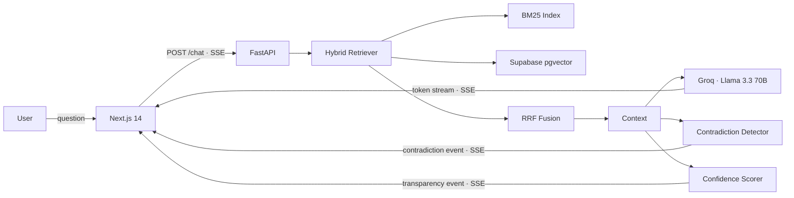

# NEXUS — The Institutional Memory Engine

> **Chat with your documents — and catch them when they contradict each other.**
> Companies lose ~42% of their institutional knowledge when senior employees leave. NEXUS doesn't let that happen.

[](https://github.com/skayy47/nexus/actions/workflows/ci.yml)
[](https://python.org)
[](https://nextjs.org)
[](LICENSE)

**[▶ Live demo](https://nexussss-two.vercel.app)** · **[API health](https://SKAY00-nexus-backend.hf.space/health)** · one click loads a corpus with built-in contradictions — no signup.

NEXUS is a production-grade RAG system that goes **beyond question answering**. It retrieves with a hybrid dense+sparse engine, detects factual contradictions across documents, attributes every answer to its exact source, and quantifies its own confidence — giving users a reason to trust (or challenge) every response.

---

## Why it's different

Most RAG pipelines retrieve context and generate an answer. NEXUS adds three layers of **epistemic hygiene** on top:

- **⚡ Contradiction Radar** — a second structured LLM pass compares retrieved chunks across documents and surfaces conflicts, with both sides quoted verbatim and a severity rating.
- **📊 Radical Transparency** — every answer ships with a deterministic confidence score (0–1), the reasoning behind it, and collapsible source cards showing the exact document, page, and excerpt.
- **🕳️ Knowledge Gaps** — when the corpus has no real answer, NEXUS says so instead of hallucinating one.
- **🔀 Hybrid Retrieval** — BM25 keyword search fused with dense vector search via Reciprocal Rank Fusion (k=60), consistently outperforming either method alone on keyword-heavy queries.

All answers stream token-by-token over SSE, and document content is wrapped in `<document>` tags to neutralise prompt injection.

---

## Architecture



### Request lifecycle

1. **Embed** — the query is encoded with `all-MiniLM-L6-v2` (384-dim, CPU, baked into the Docker image).
2. **Retrieve** — BM25 and pgvector each return top-k candidates; RRF merges the ranked lists.
3. **Generate** — an LCEL chain streams an answer from Groq Llama 3.3 70B token-by-token via SSE.
4. **Analyse** — a parallel LLM call checks retrieved chunks for contradictions; a deterministic scorer evaluates retrieval quality and source agreement.
5. **Stream** — four SSE event types (`token`, `transparency`, `contradiction`, `gap`) let the frontend update incrementally.

---

## Stack

| Layer | Technology |
|-------|-----------|
| Frontend | Next.js 14 · TypeScript · App Router |
| UI | TailwindCSS · Framer Motion · custom components · neural-canvas hero |
| Backend | FastAPI · Python 3.11 · async throughout |
| RAG framework | LangChain (LCEL only) |
| LLM | Groq → Llama 3.3 70B |
| Embeddings | `sentence-transformers/all-MiniLM-L6-v2` |
| Vector store | Supabase pgvector (IVFFlat · cosine) |
| Keyword search | BM25 (`rank_bm25`) |
| Document parsing | Unstructured (PDF · DOCX · TXT · MD) |
| Evaluation | RAGAS |
| Backend deploy | Hugging Face Spaces (Docker) |
| Frontend deploy | Vercel |

---

## Evaluation

A reproducible [RAGAS](https://github.com/explodinggradients/ragas) harness ships with the repo, scoring 20 QA pairs derived from the demo corpus.

| Metric | Target | Score |
|--------|--------|-------|
| Faithfulness | > 0.85 | _run to populate_ |
| Answer Relevancy | > 0.80 | _run to populate_ |
| Context Recall | > 0.75 | _run to populate_ |

```bash
# Requires a running backend with the demo corpus loaded
pip install -e ".[eval]"
PYTHONPATH=src python tests/eval/ragas_eval.py   # writes tests/eval/results.json
```

---

## Getting started

### Prerequisites

- Python 3.11+ · Node.js 18+
- A free [Supabase](https://supabase.com) project · a free [Groq](https://console.groq.com) API key

### Local setup

```bash
git clone https://github.com/skayy47/nexus.git
cd nexus

# 1. Python deps
pip install -e ".[dev]"

# 2. Environment
cp .env.example .env
# Edit .env — fill in GROQ_API_KEY, SUPABASE_URL, SUPABASE_KEY

# 3. One-time DB migration
#    Supabase Studio → SQL Editor → run:
#    src/nexus/index/migrations/001_create_chunks.sql

# 4. Backend
PYTHONPATH=src uvicorn nexus.api.main:app --reload --port 8000

# 5. Frontend (new terminal)
cd nexus-frontend
npm install
cp .env.local.example .env.local   # set NEXT_PUBLIC_API_URL=http://localhost:8000
npm run dev
```

Open [http://localhost:3000](http://localhost:3000) → **Try the live demo** to load the pre-built corpus, or **upload your own documents**.

> **Docker:** `docker compose up` boots the backend with the embedding model already baked in (no cold-start download).

---

## Deployment

The production demo runs on free tiers: **Vercel** (frontend) + **Hugging Face Spaces** (Docker backend) + **Supabase** (pgvector).

### Backend — Hugging Face Spaces (Docker)

Full step-by-step runbook: **[`deploy/huggingface-spaces.md`](deploy/huggingface-spaces.md)**. In short:

```bash
# Push the backend to a Docker Space (app_port: 7860)
git remote add space https://huggingface.co/spaces/<user>/nexus-backend
git push space main
```

Set these as Space **secrets/variables**: `GROQ_API_KEY`, `SUPABASE_URL`, `SUPABASE_KEY`, `PORT=7860`, `ALLOWED_ORIGINS`. The `Dockerfile` is host-portable (honours `$PORT`) and bakes the embedding model at build time so cold starts are instant.

### Frontend — Vercel

Set `NEXT_PUBLIC_API_URL` to the Space URL (e.g. `https://<user>-nexus-backend.hf.space`) and redeploy — Next.js inlines `NEXT_PUBLIC_*` at **build time**, so an env change requires a rebuild. Set the project root directory to `nexus-frontend`.

### Keeping it warm

A scheduled GitHub Action ([`.github/workflows/keepalive.yml`](.github/workflows/keepalive.yml)) pings the backend every 3 days, resetting Supabase's free-tier inactivity timer and keeping the Space awake.

---

## Testing

```bash
PYTHONPATH=src pytest tests/unit/ -v                              # unit — no external services
PYTHONPATH=src pytest tests/integration/test_e2e.py -m integration # e2e — requires running backend
pytest -m "not integration"                                      # CI mode
```

The integration suite covers the full pipeline: demo corpus loading, hybrid retrieval, SSE token streaming, contradiction detection, and document management. CI runs ruff · black · mypy (strict on `features/`) · pytest on every push.

---

## Project structure

```
nexus/
├── src/nexus/
│   ├── api/               # FastAPI routes — /chat, /upload, /demo, /documents, /insights, /health, /stats
│   ├── ingest/            # Document loading, chunking, metadata extraction
│   ├── index/             # pgvector store, BM25 index, hybrid retriever, RRF, migrations
│   ├── rag/               # LCEL chain, Groq streaming client, versioned prompts
│   ├── features/          # Contradiction detection, confidence scoring, gap detection
│   └── config.py          # Pydantic settings (whitespace-stripped secrets, env validation)
├── nexus-frontend/
│   ├── app/               # Next.js App Router — landing + chat
│   ├── components/        # LandingHero, NeuralCanvas, ChatWindow, ConfidenceBar, ContradictionBadge, SourceCard, DocumentZone …
│   └── lib/               # API client (SSE + REST, cold-start warmup), blob store
├── demo_corpus/           # 5 curated documents with intentional contradictions
├── tests/                 # unit · integration · eval (RAGAS harness + 20 QA pairs)
├── deploy/                # Hugging Face Spaces deployment runbook
├── Dockerfile · docker-compose.yml · vercel.json
└── .github/workflows/     # CI + keep-alive
```

---

## License

MIT — see [`LICENSE`](LICENSE).

Built by **[Oussama Iskia (SKAY)](https://github.com/skayy47)** — RAG · hybrid retrieval · contradiction detection.
