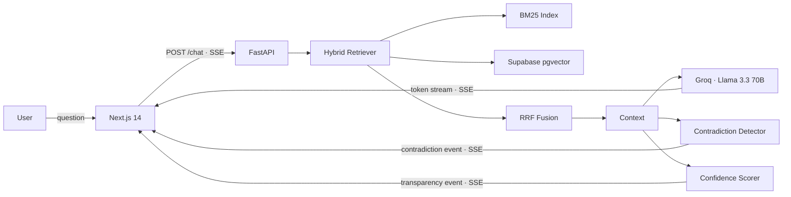

# NEXUS — Institutional Memory Engine

> Companies lose **42% of their knowledge** when senior employees leave.

[](https://github.com/skayy47/nexus/actions/workflows/ci.yml)
[](https://python.org)
[](https://nextjs.org)
[](LICENSE)

**[Live Demo →](https://nexussss-two.vercel.app)**

NEXUS is a production-grade RAG system that goes beyond question answering. It detects contradictions between documents, attributes every answer to its source, and quantifies confidence — giving users a reason to trust (or challenge) every response.

---

## Overview

Most RAG pipelines retrieve context and generate an answer. NEXUS adds three layers on top:

- **Contradiction Radar** — a second LLM pass compares retrieved chunks across documents and surfaces conflicts with both sides quoted verbatim
- **Radical Transparency** — every answer ships with a confidence score (0–100%), the reasoning behind it, and collapsible source cards showing exact excerpts
- **Hybrid Retrieval** — BM25 keyword search fused with dense vector search via Reciprocal Rank Fusion, consistently outperforming either method alone

---

## Architecture



### Request lifecycle

1. **Embed** — query is encoded with `all-MiniLM-L6-v2` (384-dim, CPU)
2. **Retrieve** — BM25 and pgvector each return top-k candidates; RRF merges the ranked lists
3. **Generate** — LCEL chain streams an answer from Groq Llama 3.3 70B token by token via SSE
4. **Analyse** — a parallel LLM call checks retrieved chunks for contradictions; a confidence scorer evaluates retrieval quality
5. **Stream** — three SSE event types (`token`, `transparency`, `contradiction`) let the frontend update incrementally

---

## Stack

| Layer | Technology |
|-------|-----------|
| Frontend | Next.js 14 · TypeScript · App Router |
| UI | TailwindCSS · Framer Motion · shadcn/ui |
| Backend | FastAPI · Python 3.11 · async throughout |
| RAG Framework | LangChain LCEL |
| LLM | Groq → Llama 3.3 70B |
| Embeddings | `sentence-transformers/all-MiniLM-L6-v2` |
| Vector Store | Supabase pgvector |
| Keyword Search | BM25 (`rank_bm25`) |
| Document Parsing | Unstructured (PDF · DOCX · TXT · MD) |
| Evaluation | RAGAS |
| Backend Deploy | Railway · Dockerfile |
| Frontend Deploy | Vercel |

---

## Evaluation

Evaluated on 20 QA pairs derived from the demo corpus using [RAGAS](https://github.com/explodinggradients/ragas).

| Metric | Target | Score |
|--------|--------|-------|
| Faithfulness | > 0.85 | TBD |
| Answer Relevancy | > 0.80 | TBD |
| Context Recall | > 0.75 | TBD |

```bash
# Reproduce (requires running backend with demo corpus loaded)
PYTHONPATH=src python tests/eval/ragas_eval.py
```

---

## Getting Started

### Prerequisites

- Python 3.11+
- Node.js 18+
- A [Supabase](https://supabase.com) project (free tier)
- A [Groq](https://console.groq.com) API key (free tier)

### Local setup

```bash
git clone https://github.com/skayy47/nexus.git
cd nexus

# 1. Install Python dependencies
pip install -e ".[dev]"

# 2. Configure environment
cp .env.example .env
# Edit .env — fill in GROQ_API_KEY, SUPABASE_URL, SUPABASE_KEY

# 3. Run the database migration (one-time)
# Open Supabase Studio → SQL Editor → paste and run:
# src/nexus/index/migrations/001_create_chunks.sql

# 4. Start the backend
PYTHONPATH=src uvicorn nexus.api.main:app --reload --port 8000

# 5. Start the frontend (new terminal)
cd nexus-frontend
npm install
npm run dev
```

Open [http://localhost:3000](http://localhost:3000) and click **Try Demo** to load the pre-built corpus.

---

## Deployment

### Backend — Railway

```bash
# Railway auto-detects railway.json and Dockerfile
# Set the following environment variables in the Railway dashboard:
GROQ_API_KEY=...
SUPABASE_URL=...
SUPABASE_KEY=...
LLM_BACKEND=groq
ALLOWED_ORIGINS=https://your-frontend.vercel.app
PORT=8000
```

The `railway.json` at the repo root configures the build, healthcheck, and restart policy. The embedding model is baked into the Docker image at build time — no cold-start download penalty.

### Frontend — Vercel

```bash
# Set the following environment variable in the Vercel dashboard:
NEXT_PUBLIC_API_URL=https://your-backend.railway.app
```

Vercel auto-detects the Next.js framework. Set the root directory to `nexus-frontend` during import.

---

## Testing

```bash
# Unit tests — no external services required
PYTHONPATH=src pytest tests/unit/ -v

# Integration tests — requires running backend
PYTHONPATH=src pytest tests/integration/test_e2e.py -v -m integration

# Skip integration tests in CI
pytest -m "not integration"
```

The integration suite covers the full pipeline: demo corpus loading, hybrid retrieval, SSE token streaming, contradiction detection, and document management.

---

## Project Structure

```
nexus/
├── src/nexus/
│   ├── api/               # FastAPI routes — /chat, /upload, /demo, /documents, /insights
│   ├── ingest/            # Document loading, chunking, metadata extraction
│   ├── index/             # pgvector store, BM25 index, hybrid retriever, RRF
│   ├── rag/               # LCEL chain, Groq streaming client, versioned prompts
│   ├── features/          # Contradiction detection, confidence scoring
│   └── config.py          # Pydantic settings with environment validation
├── nexus-frontend/
│   ├── app/               # Next.js App Router — landing page + chat interface
│   ├── components/        # ChatWindow, ConfidenceBar, ContradictionBadge, SourceCard, …
│   └── lib/               # API client (SSE + REST), blob URL store
├── demo_corpus/           # 5 curated documents with intentional contradictions
├── tests/
│   ├── unit/              # Isolated unit tests
│   ├── integration/       # End-to-end tests against live backend
│   └── eval/              # RAGAS harness + 20 annotated QA pairs
├── Dockerfile
├── railway.json
└── vercel.json
```

---

Built by [Oussama skia](https://github.com/skayy47)
